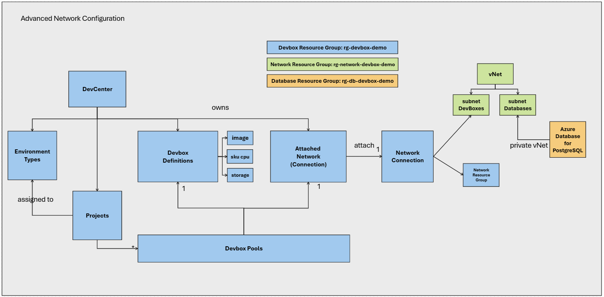
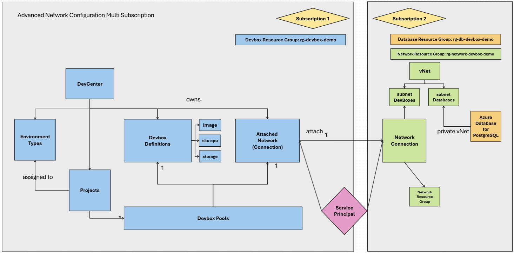

# DEVCenter CLI

The aim of this page is to display all the commands to manage the devbox using CLI

# Summary

This guide provides a step-by-step process to configure a DevCenter using Azure CLI commands. It will connect the devbox to a dedicated vNet hosting a Postgres Database.

The main steps include:

1. **Prerequisites**: Log in to Azure and add the DevCenter extension.
2. **DevCenter**: Create a new resource group and DevCenter.
3. **Add DevBox Definition**: List available DevBox definitions and images, select an image, and create a new DevBox definition.
4. **Add Environment Types**: Create environment types such as `DevTest` and `QAandUAT`.
5. **Add Network Connection**: Create a virtual network, subnets, and a network connection, then attach it to the DevCenter.
6. **Databases**: Create an Azure Database for PostgreSQL in the specified subnet.
7. **Project**: Define a new project and assign environment types to it.
8. **Manage Devbox Pools**: Create and list DevBox pools with managed and unmanaged networks.
9. **Manage Users**: Assign users to the project with appropriate roles.

The full bash script is available here [scripts/setup_devbox.sh](scripts/setup_devbox.sh)



# Table of Contents

- [Prerequisites](#prerequisites)
- [DevCenter](#devcenter)
  - [New DevCenter](#new-devcenter)
  - [Add DevBox Definition](#add-devbox-definition)
  - [Add Environment Types](#add-environment-types)
  - [Add Network Connection](#add-network-connection)
- [Databases](#databases)
  - [Azure Database for PostgreSQL](#azure-database-for-postgresql)
- [Project](#project)
  - [Define a Project](#define-a-project)
  - [Assign Environment Type to the Project](#assign-environment-type-to-the-project)
  - [Manage Devbox Pools](#manage-devbox-pools)
  - [Manage Users](#manage-users)
- [The Dev Box](#the-dev-box)
- [Multiple Subscriptions](#multiple-subscriptions)
  - [Introduction](#introduction)
  - [New Application](#new-application)
  - [Network & Database](#network--database)
  - [Dev Center](#dev-center)

# Prerequisites

```
az login
az extension add --name devcenter
```

# DevCenter

## New DevCenter

```
az group create  --location centralindia --resource-group rg-devbox-demo
az devcenter admin devcenter create --location "centralindia" --tags CostCode="12345" --name "ContosoDevCenter" --resource-group "rg-devbox-demo"
```

## Add DevBox Definition

```
az devcenter admin devbox-definition list -g rg-devbox-demo --dev-center ContosoDevCenter -o table
az devcenter admin image list -g rg-devbox-demo --dev-center ContosoDevCenter --output table --query "[].{resource:resourceGroup, name:name, description:description}" 

# we choose microsoftvisualstudio_visualstudio2019plustools_vs-2019-ent-general-win11-m365-gen2 as image for our devboxes
image_id=$(az devcenter admin image show --name microsoftvisualstudio_visualstudio2019plustools_vs-2019-ent-general-win11-m365-gen2  -g rg-devbox-demo --dev-center ContosoDevCenter --gallery-name Default --output tsv --query "id" )
echo $image_id 
#az devcenter admin sku list --output table
az devcenter admin devbox-definition create --location "centralindia" --image-reference id="${image_id}" --os-storage-type "ssd_512gb" --sku name="general_i_8c32gb512ssd_v2" --name "WebDevBox" -g rg-devbox-demo --dev-center ContosoDevCenter
az devcenter admin devbox-definition list -g rg-devbox-demo --dev-center ContosoDevCenter -o table
```

## Add Environment Types

Add 2 environment types: `DevTest` and `QAandUAT`

```
az devcenter admin  environment-type list -g rg-devbox-demo --dev-center ContosoDevCenter 
az devcenter admin  environment-type create -g rg-devbox-demo --dev-center ContosoDevCenter  --name "DevTest"
az devcenter admin  environment-type create -g rg-devbox-demo --dev-center ContosoDevCenter  --name "QAandUAT"
az devcenter admin  environment-type list -g rg-devbox-demo --dev-center ContosoDevCenter  --output table
```

## Add Network connection

[Documentation](https://learn.microsoft.com/en-us/azure/dev-box/how-to-configure-network-connections?tabs=AzureADJoin)

Note: modify the IP Address Prefix and the subnet network masks according to your constraints.

```
az group create  --location centralindia --resource-group rg-network-devbox-demo
az network vnet create --name MyVNet1 --resource-group rg-network-devbox-demo --address-prefix 10.0.0.0/16 --subnet-name default --subnet-prefix 10.0.0.0/24
#add a subnet for databases in this vNet
az network vnet subnet create --resource-group rg-network-devbox-demo --vnet-name MyVNet1 --name vnet-for-databases --address-prefix 10.0.2.0/24
#add a subnet for devboxes in this vNet
az network vnet subnet create --resource-group rg-network-devbox-demo --vnet-name MyVNet1 --name vnet-for-devboxes --address-prefix 10.0.4.0/24

devbox_subnet_id=$( az network vnet subnet show --name vnet-for-devboxes --resource-group rg-network-devbox-demo  --vnet-name "MyVNet1" -o tsv --query id)
echo $devbox_subnet_id

#Create a network connection
az devcenter admin network-connection create --location centralindia --domain-join-type "AzureADJoin" --networking-resource-group-name "DevBoxNetworkInterfacesRG" --subnet-id ${devbox_subnet_id}  --name "DevboxDefaultNetworkConnection"  --resource-group rg-devbox-demo

#Attach the Network Connection to the Dev Center
nc_id=$(az devcenter admin network-connection show --name DevboxDefaultNetworkConnection -g rg-devbox-demo -o tsv --query id)
echo $nc_id
az devcenter admin attached-network create --attached-network-connection-name AttachedDevboxDefaultNetworkConnection -g rg-devbox-demo --dev-center ContosoDevCenter  --network-connection-id ${nc_id}
```

# Databases

## Azure Database for PostgreSQL

Create a database in the `vnet-for-databases` subnet.

```
az group create  --location centralindia --resource-group rg-db-devbox-demo
db_subnet_id=$(az network vnet subnet show --name vnet-for-databases --resource-group rg-network-devbox-demo  --vnet-name "MyVNet1" -o tsv --query id)
echo $db_subnet_id
az postgres flexible-server create --resource-group rg-db-devbox-demo --name myDevBoxPostgresServer --location centralindia --admin-user devboxadminpg --admin-password 1974@microsoft  --sku-name standard_d2s_v3 --tier generalpurpose   --subnet ${db_subnet_id}
#note if you have the quesgion: Do you want to create a new private DNS zone .... Answer Yes
```

# Project

## Define a Project

```
#get the devcenter id
devcenter_id=$( az devcenter admin devcenter show --name ContosoDevCenter -o tsv --query '[id]' --resource-group rg-devbox-demo)
az devcenter admin project list
az devcenter admin project create --location "centralindia" --description "This is my first project." --dev-center-id "${devcenter_id}" --tags CostCenter="DevTeam1" --name "Project1" --resource-group "rg-devbox-demo" --max-dev-boxes-per-user "2"
az devcenter admin project list -o table --query "[].{resource:resourceGroup, name:name, location:location}" 
```

## Assign Environment Type to the Project

```
az devcenter admin project-environment-type list --project-name "Project1" --resource-group "rg-devbox-demo"
subscription_id=$(az account show -o tsv --query '[id]')
echo $subscription_id 
az devcenter admin project-environment-type create --environment-type-name "DevTest"  --project-name "Project1" --resource-group "rg-devbox-demo" --deployment-target-id "/subscriptions/${subscription_id}" --status "Enabled"  --identity-typ SystemAssigned --roles "{\"4cbf0b6c-e750-441c-98a7-10da8387e4d6\":{}}"
```

## Manage Devbox pools

``` 
az devcenter admin pool list  --project-name "Project1" --resource-group "rg-devbox-demo"

# Create a devbox pool with a Managed Network (Microsoft)
az devcenter admin pool create --pool-name "DevPoolManaged" --devbox-definition-name "WebDevBox" --project-name "Project1" --resource-group "rg-devbox-demo" --location "centralindia"  --local-administrator "Enabled" --virtual-network-type "Managed" --single-sign-on-status "Enabled" --managed-virtual-network-regions centralindia

# Create a devbox pool with a Unmanaged Network (by Microsoft) Bring your own network management
az devcenter admin pool create --pool-name "DevBoxPoolDatabases" --devbox-definition-name "WebDevBox" --project-name "Project1" --resource-group "rg-devbox-demo" --location "centralindia"  --local-administrator "Enabled" --virtual-network-type "Unmanaged" --single-sign-on-status "Enabled"   --network-connection-name AttachedDevboxDefaultNetworkConnection

az devcenter admin pool list  --project-name "Project1" --resource-group "rg-devbox-demo"  -o table
```

## Manage Users

Let the user bob@LEBO.onmicrosoft.com access to the project `Project1`

```
project_id=$(az devcenter admin project show --name Project1 -g rg-devbox-demo -o tsv --query id)
# replace bob@LEBO.onmicrosoft.com by another user id
user_id=$(az ad user show --id "bob@LEBO.onmicrosoft.com" --query "id" --output tsv)
az role assignment create --assignee ${user_id} --role "DevCenter Dev Box User" --scope ${project_id}
```

# The Dev Box

* Open the devportal and create a devbox : https://devportal.microsoft.com/
* Connect on the devbox and run vscode
* Follow the steps in this (page)[https://data-nerd.blog/2020/02/06/postgresql-extension-for-vscode/] to validate the PGSQL connection with the following parameter
    * server: mydevboxpostgresserver.postgres.database.azure.com 
    * database: postgres
    * username: devboxadminpg
    * password: 1974@microsoft
    * port: default
* Query: `SELECT * FROM pg_stat_activity;`

Another test is to run the ping command on the database and validate its IP in  `10.0.2.0/24` 

```
ping mydevboxpostgresserver.postgres.database.azure.com 

Pinging b4c99b7dc378.mydevboxpostgresserver.private.postgres.database.azure.com [10.0.2.4] with 32 bytes of data:
Reply from 10.0.2.4: bytes=32 time=1ms TTL=63
Reply from 10.0.2.4: bytes=32 time<1ms TTL=63
Reply from 10.0.2.4: bytes=32 time<1ms TTL=63
Reply from 10.0.2.4: bytes=32 time<1ms TTL=63

Ping statistics for 10.0.2.4:
    Packets: Sent = 4, Received = 4, Lost = 0 (0% loss),
Approximate round trip times in milli-seconds:
    Minimum = 0ms, Maximum = 1ms, Average = 0ms
```

# Multiple subscriptions

## Introduction

If the different resources don't belong to the same subcription (but still in the same tenant)
1. One subscription for all the dabatases resources 
1. One subscription for to manage the devbox configurations and the runnig instances.

Check the schema below



* All the commmands targeting the `rg-devbox-demo` belong to the `subscription1`
* All the commmands targeting the `rg-db-devbox-demo` and `rg-network-devobox-demo` belong to the `subscription2`

## New application

Using `subscription1` or `subscription2`, run the following commands to create a new `myServicePrincipalForDevBox` application at the tenant level, visible by the 2 subscriptions.

This application will receive the `Contributor` role on 2 resources : 
* Attached Network Connection (`subscription1`)
* Network Connection (`subscription2`)

```
tenantId=$(az account  show -o tsv --query "{tenantId:tenantId}")
appPassword=$(az ad sp create-for-rbac --name myServicePrincipalForDevBox -o tsv --query "{password:password}")
echo "${appPassword}
appId=$(az ad sp list --display-name myServicePrincipalForDevBox --query "[].appId" -o tsv)
echo "${appId}
# az login --service-principal -u ${appID} -p ${appPassword} -t ${tenantId}
```

## Network & Database

Using `subscription2`

```
subscription2="yyyyyyyy"
az login --subscription $subscription2
```

### Add vNet and subnet
```
az group create --location centralindia --resource-group rg-network-devbox-demo
az network vnet create --name MyVNet1 --resource-group rg-network-devbox-demo --address-prefix 10.0.0.0/16 --subnet-name default --subnet-prefix 10.0.0.0/24
az network vnet subnet create --resource-group rg-network-devbox-demo --vnet-name MyVNet1 --name vnet-for-databases --address-prefix 10.0.2.0/24
az network vnet subnet create --resource-group rg-network-devbox-demo --vnet-name MyVNet1 --name vnet-for-devboxes --address-prefix 10.0.4.0/24
```
### Add DevBox Network connection (subscription2)
```
devbox_subnet_id=$(az network vnet subnet show --name vnet-for-devboxes --resource-group rg-network-devbox-demo --vnet-name "MyVNet1" -o tsv --query id)
echo $devbox_subnet_id
az devcenter admin network-connection create --location centralindia --domain-join-type "AzureADJoin" --networking-resource-group-name "DevBoxNetworkInterfacesRG" --subnet-id ${devbox_subnet_id} --name "DevboxDefaultNetworkConnection" --resource-group rg-network-devbox-demo
nc_id=$(az devcenter admin network-connection show --name DevboxDefaultNetworkConnection -g rg-network-devbox-demo -o tsv --query id)
echo $nc_id
```

### Assign the Contributor role to devcenter network connection on appId
```
az role assignment create --assignee ${appId} --role "Contributor" --scope $nc_id
```

### Create the database as usual


## Dev Center

Using `subscription1`

```
subscription1="xxxxx"
az login --subscription $subscription1
```

### Create the devcenter 

```
az group create  --location centralindia --resource-group rg-devbox-demo
az devcenter admin devcenter create --location "centralindia" --tags CostCode="12345" --name "ContosoDevCenter" --resource-group "rg-devbox-demo"
```

### Assign the Contributor role to devcenter network connection on appId

```
appId=$(az ad sp list --display-name myServicePrincipalForDevBox --query "[].appId" -o tsv)
az role assignment create --assignee ${appId} --role "Contributor" --scope /subscriptions/${subscription1}/resourceGroups/rg-devbox-demo/providers/Microsoft.DevCenter/devcenters/ContosoDevCenter
```

### Attach the Network Connection to DevCenter

```
appId=$(az ad sp list --display-name myServicePrincipalForDevBox --query "[].appId" -o tsv)
tenantId=$(az account  show -o tsv --query "{tenantId:tenantId}")

az login --service-principal -u ${appID} -p ${appPassword} -t ${tenantId}

nc_id="/subscriptions/${subscription2}/resourceGroups/rg-network-devbox-demo/providers/Microsoft.DevCenter/networkConnections/DevboxDefaultNetworkConnection"
az devcenter admin attached-network create --attached-network-connection-name AttachedDevboxDefaultNetworkConnection -g rg-devbox-demo --dev-center ContosoDevCenter --network-connection-id ${nc_id}

az logout
```

The other commands remain the same.