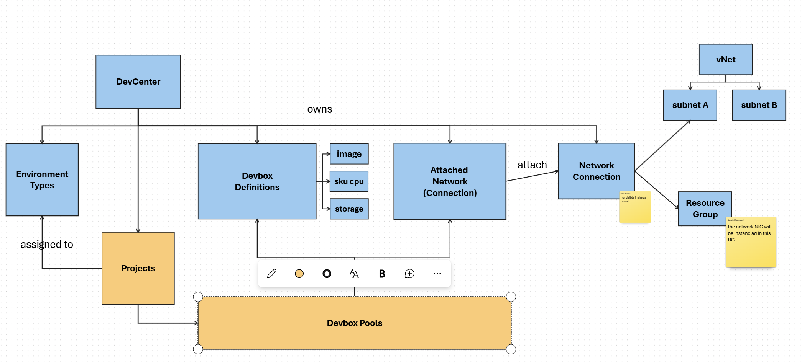

# DEVCenter CLI

The aim of this page is to display all the commands to manage the devbox using CLI



# Prerequisites

```
az login
az extension add --name devcenter
```

# DevCenter

## New DevCenter

```
az group create  --location centralindia --resource-group rg-devbox-demo
az devcenter admin devcenter create --location "centralindia" --tags CostCode="12345" --name "ContosoDevCenter" --resource-group "rg-devbox-demo"
```


## Add DevBox Definition

```
az devcenter admin devbox-definition list -g rg-devbox-demo --dev-center ContosoDevCenter
az devcenter admin image list -g rg-devbox-demo --dev-center ContosoDevCenter --output table --query "[].{resource:resourceGroup, name:name}" 
image_id=$(az devcenter admin image show --name microsoftvisualstudio_visualstudio2019plustools_vs-2019-ent-general-win11-m365-gen2  -g rg-devbox-demo --dev-center ContosoDevCenter --gallery-name Default--output tsv --query "id" )

#az devcenter admin sku list --output table
az devcenter admin devbox-definition create --location "centralindia" --image-reference id="${image_id}" --os-storage-type "ssd_512gb" --sku name="general_i_8c32gb512ssd_v2" --name "WebDevBox" -g rg-devbox-demo --dev-center ContosoDevCenter
```

## Add Environment Types

Add 2 environment types: `DevTest` and `QAandUAT`

```
az devcenter admin  environment-type list -g rg-devbox-demo --dev-center ContosoDevCenter 
az devcenter admin  environment-type create -g rg-devbox-demo --dev-center ContosoDevCenter  --name "DevTest"
az devcenter admin  environment-type create -g rg-devbox-demo --dev-center ContosoDevCenter  --name "QAandUAT"
az devcenter admin  environment-type list -g rg-devbox-demo --dev-center ContosoDevCenter  --output table
```

## Add Network connection

[Documentation](https://learn.microsoft.com/en-us/azure/dev-box/how-to-configure-network-connections?tabs=AzureADJoin)

```
az network vnet create --name MyVNetForDevBox --resource-group rg-devbox-demo --address-prefix 10.0.0.0/16 --subnet-name default --subnet-prefix 10.0.0.0/24
subnet_id=$( az network vnet subnet show  --name default  --resource-group rg-devbox-demo   --vnet-name "MyVNetForDevBox" -o tsv --query id)

#Create a basic network connection
az devcenter admin network-connection create --location centralindia --domain-join-type "AzureADJoin" --networking-resource-group-name "DevBoxNetworkInterfacesRG" --subnet-id ${subnet_id}  --name "DevboxDefaultNetworConnection"  --resource-group rg-devbox-demo

#Attach the Network Connection to the Dev Center
nc_id=$(az devcenter admin network-connection show --name DevboxDefaultNetworConnection -g rg-devbox-demo -o tsv --query id)
az devcenter admin attached-network create --attached-network-connection-name AttachedDevboxDefaultNetworConnection -g rg-devbox-demo --dev-center ContosoDevCenter  --network-connection-id ${nc_id}
```

# Project

## Define a Project

```
#get the devcenter id
devcenter_id=$( az devcenter admin devcenter show --name ContosoDevCenter -o tsv --query '[id]' --resource-group rg-devbox-demo)
az devcenter admin project list
az devcenter admin project create --location "centralindia" --description "This is my first project." --dev-center-id "${devcenter_id}" --tags CostCenter="DevTeam1" --name "DevProject" --resource-group "rg-devbox-demo" --max-dev-boxes-per-user "2"
az devcenter admin project list -o table --query "[].{resource:resourceGroup, name:name, location:location}" 
```

## Assign Environment Type to the Projet

```
az devcenter admin project-environment-type list --project-name "DevProject" --resource-group "rg-devbox-demo"
subscription_id=$(az account show -o tsv --query '[id]')
az devcenter admin project-environment-type create --environment-type-name "DevTest"  --project-name "DevProject" --resource-group "rg-devbox-demo" --deployment-target-id "/subscriptions/${subscription_id}" --status "Enabled"  --identity-typ SystemAssigned --roles "{\"4cbf0b6c-e750-441c-98a7-10da8387e4d6\":{}}"
```

## Manage Devbox pools

``` 
az devcenter admin pool list  --project-name "DevProject" --resource-group "rg-devbox-demo"

# Create a devbox pool with a Managed Network (Microsoft)
az devcenter admin pool create --pool-name "DevPoolManaged" --devbox-definition-name "WebDevBox" --project-name "DevProject" --resource-group "rg-devbox-demo" --location "centralindia"  --local-administrator "Enabled" --virtual-network-type "Managed" --single-sign-on-status "Enabled" --managed-virtual-network-regions centralindia

# Create a devbox pool with a Unmanaged Network (by Microsoft) Bring your own network management
az devcenter admin pool create --pool-name "DevPoolUnmanaged" --devbox-definition-name "WebDevBox" --project-name "DevProject" --resource-group "rg-devbox-demo" --location "centralindia"  --local-administrator "Enabled" --virtual-network-type "Unmanaged" --single-sign-on-status "Enabled"   --network-connection-name AttachedDevboxDefaultNetworConnection

az devcenter admin pool list  --project-name "DevProject" --resource-group "rg-devbox-demo"  -o table
```